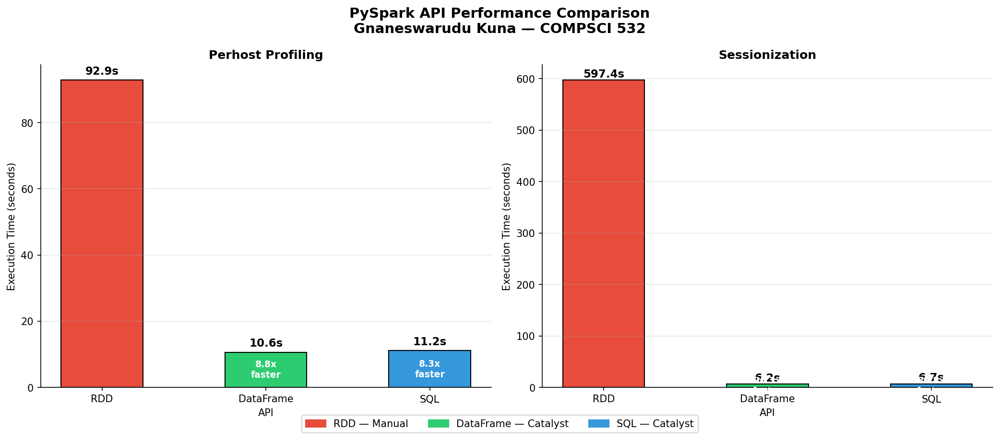

# A Comparative Analysis of PySpark's RDD, DataFrame, and SQL APIs on E-Commerce Web Server Logs

**Author:** Gnaneswarudu Kuna
**Course:** COMPSCI 532 — Systems for Data Science
**University:** UMass Amherst

## Project Description and Relevance

Modern data engineering teams routinely process logs, clickstreams, and event records at scale using distributed batch-processing frameworks. Understanding how different programming abstractions within these frameworks affect performance is a critical systems concern. This project investigates that question empirically using Apache Spark and a real-world e-commerce web server log dataset.

Specifically, I benchmark three levels of abstraction available in PySpark — the low-level RDD API, the structured DataFrame API, and Spark SQL — by implementing the same analytical queries at each level and measuring key systems performance metrics. The dataset used is the [Zanbil.ir E-Commerce Web Server Access Logs](https://www.kaggle.com/datasets/eliasdabbas/web-server-access-logs) [1] — approximately 10.3 million HTTP requests totaling ~3.3 GB uncompressed, recorded from a real Iranian e-commerce platform. It uses the Apache Combined Log Format, containing fields for client IP, timestamp, HTTP method, request path, status code, and response bytes. Two additional fields (Referer and User-Agent) are present but ignored during parsing.

The analytical pipeline consists of two core queries:

1. **Per-Host Traffic Profiling** — aggregating request counts, byte volumes, error rates, and distinct endpoint counts per unique client IP
2. **Sessionization** — grouping each client's requests into sessions defined by a 30-minute inactivity threshold, then computing session-level metrics such as duration and request count per session

Each query is implemented independently using all three APIs — RDD, DataFrame, and SQL — producing identical outputs to ensure a fair comparison. The central systems question is: **how much does Spark's Catalyst query optimizer improve performance over hand-tuned RDD code, and under what conditions?**

The RDD API requires the programmer to manually manage every transformation — including partitioning strategy, shuffle operations, and aggregation logic. In contrast, the DataFrame and SQL interfaces delegate these decisions to Spark's Catalyst optimizer, which automatically rewrites query plans, pushes filters early, and selects efficient join and aggregation strategies. By holding the workload constant across all three implementations, we can isolate the effect of the optimizer on real execution behavior.

This work connects directly to the course's coverage of the Spark execution model (Lecture 8), the original RDD paper by Zaharia et al. [2], and the broader theme of evaluating system design tradeoffs between programmer control and automatic optimization.

To characterize performance, four systems-level metrics are collected for each query and API combination:
- **Wall-clock execution time** — end-to-end latency measured using Python timers
- **Shuffle read/write volume** — data moved across the network during wide transformations
- **Number of stages and tasks** — complexity of the physical execution plan
- **Peak memory usage** — maximum JVM heap consumed during execution

## Dataset

| Property | Value |
|----------|-------|
| Name | Zanbil.ir E-Commerce Web Server Access Logs |
| Size | ~3.3 GB uncompressed |
| Records | 10,365,152 HTTP requests |
| Source | [Kaggle](https://www.kaggle.com/datasets/eliasdabbas/web-server-access-logs) |
| Format | Apache Combined Log Format |
| Time Period | January 2019 |

Each log line looks like: 54.36.149.41 - - [22/Jan/2019:03:56:14 +0330] "GET /product/123 HTTP/1.1" 20

## The 3 APIs Compared

| API | Description | Optimization |
|-----|-------------|-------------|
| RDD | Low level manual code — you control every step | None — fully manual |
| DataFrame | Structured table operations — like a spreadsheet | Catalyst optimizer |
| SQL | Plain SQL queries — familiar database syntax | Catalyst optimizer |

## Queries Implemented

### 1. Per-Host Traffic Profiling
For each unique IP address computes:
- Total number of requests
- Total bytes transferred
- Average bytes per request
- Error rate (percentage of 4xx and 5xx responses)
- Number of distinct endpoints visited

Implemented in: RDD, DataFrame, SQL

### 2. Sessionization
Groups each user's requests into sessions. A new session starts when the user is inactive for more than 30 minutes. Computes:
- Total session count per user
- Average session duration in seconds
- Average number of requests per session

Implemented in: RDD, DataFrame, SQL

## Benchmark Results — 10 Million Rows

### Per-Host Traffic Profiling
| API | Time | Speedup vs RDD |
|-----|------|---------------|
| RDD | 92.916s | baseline |
| DataFrame | 10.605s | **8.7x faster** |
| SQL | 11.157s | **8.3x faster** |

### Sessionization
| API | Time | Speedup vs RDD |
|-----|------|---------------|
| RDD | 597.373s | baseline |
| DataFrame | 6.216s | **96x faster** |
| SQL | 6.651s | **90x faster** |

## Key Findings

1. **DataFrame and SQL are dramatically faster than RDD** — up to 96x faster for complex queries like sessionization
2. **The Catalyst optimizer is the reason** — it automatically rewrites execution plans, pushes filters early and chooses efficient aggregation strategies
3. **RDD is more competitive for simple queries** — per-host profiling shows only 8x difference vs sessionization's 96x difference
4. **SQL and DataFrame perform similarly** — both use the same Catalyst optimizer under the hood
5. **Sessionization shows the biggest gap** — window functions require full data ordering which RDD handles in Python while Catalyst generates optimized JVM bytecode

## Setup Instructions

> **Note:** Recommended on Mac or Linux. Windows users should use WSL.

### Prerequisites
- Python 3.12+
- Java 21
- 4GB+ RAM recommended
- Git

### Step 1 — Clone the repository
git clone https://github.com/gnaneswarudukuna/spark-benchmark.git
cd spark-benchmark
### Step 2 — Create and activate virtual environment

Mac/Linux:
python3 -m venv venv
source venv/bin/activate
### Step 3 — Install all dependencies
pip install -r requirements.txt

### Step 4 — Install Java 21

Mac:
brew install openjdk@21
sudo ln -sfn /opt/homebrew/opt/openjdk@21/libexec/openjdk.jdk /Library/Java/JavaVirtualMachines/openjdk-21.jdk

### Step 5 — Configure environment variables
cp .env.example .env
Edit .env and set these values:
JAVA_HOME=/opt/homebrew/opt/openjdk@21/libexec/openjdk.jdk/Contents/Home
SPARK_MASTER=local[4]
SPARK_APP_NAME=spark-benchmark
RAW_LOG_PATH=data/raw/access.log
PROCESSED_PATH=data/processed/access_logs

## Run Preprocessing Pipeline

Requires Java 21. Set JAVA_HOME in .env if needed.

1. Download the [Zanbil / web server access logs](https://www.kaggle.com/datasets/eliasdabbas/web-server-access-logs) dataset from Kaggle and place the uncompressed access.log at data/raw/access.log
2. Edit .env and set SPARK_MASTER=local[N] to your CPU count
3. From the repository root with your venv activated:

python3 -m src.parsing.log_parser

On success Spark writes Snappy Parquet files under data/processed/access_logs/. The job prints raw line count, cleaned row count and parse rate. With the full dataset you should see approximately 10.3 million cleaned rows at 100% parse rate.

## Run Benchmark Locally

Requires the Parquet data from the preprocessing pipeline above.

### Run individual queries
python3 -m src.queries.perhost_profiling.rdd
python3 -m src.queries.perhost_profiling.dataframe
python3 -m src.queries.perhost_profiling.sql
python3 -m src.queries.sessionization.rdd
python3 -m src.queries.sessionization.dataframe
python3 -m src.queries.sessionization.sql
### Run full benchmark
python3 -m benchmark.run_benchmark
### Generate comparison charts
python3 results/generate_charts.py
### Run analysis
python3 analysis/results_analysis.py
### Using Makefile shortcuts
make setup      # Install dependencies
make parse      # Run log parsing pipeline
make benchmark  # Run full benchmark
make test       # Run all tests
make charts     # Generate comparison charts
make analysis   # Print results analysis
make help       # Show all available commands
## Test Cases

- Unit tests using pytest verify that each API produces consistent and correct output
- Tests verify that DataFrame and SQL sessionization return the same number of unique hosts
- Tests verify all required output columns exist for each query type
- Tests verify all hosts have at least 1 session assigned

To run the test suite locally (Parquet must already exist):
pytest tests/ -v

## Experimental Results

### Wall-clock execution time

Key observations:
- RDD is significantly slower than DataFrame and SQL for both queries
- Sessionization shows the biggest gap — RDD takes 597 seconds vs 6 seconds for DataFrame
- The Catalyst optimizer is the primary reason for the performance difference
- SQL and DataFrame perform similarly because they share the same optimizer

### Why RDD is slower
- No automatic query optimization — every step runs exactly as written
- groupByKey shuffles ALL data across the network before aggregation
- Python UDFs add serialization overhead between JVM and Python processes
- Window functions in Python require loading all timestamps per user into memory

### Why DataFrame and SQL are faster
- Catalyst optimizer automatically rewrites queries for efficiency
- Predicate pushdown — filters applied before shuffling reduces data movement
- Partial aggregation — combines values locally before network transfer
- Tungsten execution engine — optimized memory management and code generation

## Project Structure
spark-benchmark/
├── src/
│   ├── utils/
│   │   └── spark_session.py
│   ├── parsing/
│   │   └── log_parser.py
│   └── queries/
│       ├── perhost_profiling/
│       │   ├── rdd.py
│       │   ├── dataframe.py
│       │   └── sql.py
│       └── sessionization/
│           ├── rdd.py
│           ├── dataframe.py
│           └── sql.py
├── benchmark/
│   └── run_benchmark.py
├── analysis/
│   └── results_analysis.py
├── results/
│   ├── wall_clock.json
│   ├── generate_charts.py
│   └── charts/
│       └── benchmark_comparison.png
├── tests/
│   ├── conftest.py
│   └── test_sessionization.py
├── notebooks/
├── dataproc/
├── Makefile
├── .env.example
└── requirements.txt
## Technologies

| Tool | Version | Purpose |
|------|---------|---------|
| Python | 3.13 | Primary language |
| PySpark | 3.5.3 | Distributed data processing |
| Java | 21 | Required JVM for Spark |
| Matplotlib | 3.10.1 | Benchmark charts |
| Pandas | 2.2.3 | Results analysis |
| pytest | 9.0.3 | Unit testing |
| Git/GitHub | — | Version control |

## AI Usage

- AI assistance was used to help understand PySpark concepts and implement query logic
- AI assistance was used to help design the sessionization SQL pipeline using LAG and cumulative SUM window functions
- AI assistance was used to help visualize benchmark results using matplotlib
- All AI-generated code was reviewed, tested and verified by running on the full 10 million row dataset

## Citations

[1] Dabbas, E. (n.d.). Web server access logs. Kaggle. https://www.kaggle.com/datasets/eliasdabbas/web-server-access-logs

[2] Matei Zaharia, Mosharaf Chowdhury, Tathagata Das, Ankur Dave, Justin Ma, Murphy McCauly, Michael J. Franklin, Scott Shenker, & Ion Stoica (2012). Resilient Distributed Datasets: A Fault-Tolerant Abstraction for In-Memory Cluster Computing. In 9th USENIX Symposium on Networked Systems Design and Implementation (NSDI 12) (pp. 15-28). USENIX Association.